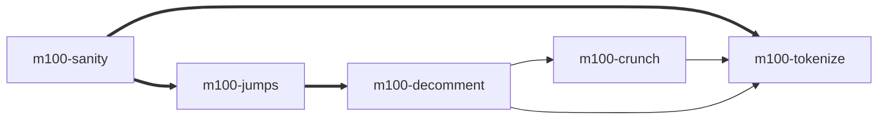

# Model 100 Tokenizer in C

An external "tokenizer" for the TRS-80 Model 100 BASIC language.
Converts BASIC programs in ASCII text (`.DO`) to executable BASIC
(`.BA`) on a host machine. Useful for large programs which the Model
100 cannot tokenize due to memory limitations.

	$ cat FOO.DO
	10 ?"Hello!"

	$ tokenize FOO.DO 
	Tokenizing 'FOO.DO' into 'FOO.BA'

	$ hd FOO.BA
	00000000  0f 80 0a 00 a3 22 48 65  6c 6c 6f 21 22 00        |....."Hello!".|
	0000000e

")

This program creates an executable BASIC file that works on the Model
100, the Tandy 102, Tandy 200, Kyocera Kyotronic-85, and Olivetti M10.
Those five machine have [identical
tokenization](http://fileformats.archiveteam.org/wiki/Tandy_200_BASIC_tokenized_file).
It does not (yet) work for the NEC PC-8201/8201A/8300 whose N82 BASIC
has a different tokenization.

Additionally, this project provides a decommenter and cruncher
(whitespace remover) to save bytes in the tokenized output. This
allows one to have both well-commented, easy to read source code and a
small executable size.

## Introduction

The Tandy/Radio-Shack Model 100 portable computer can save its BASIC
files in ASCII (plain text) or in a _“tokenized”_ format where the
keywords — such as `FOR`, `IF`, `PRINT`, `REM` — are converted to a
single byte. The Model 100 automatically tokenizes an ASCII program
when it is `LOAD`ed so that it can be `RUN` or `SAVE`d. The tokenized
format saves space and loads faster.

### The problem

Programs for the Model 100 are generally distributed in ASCII format
which is good for portability and easy transfer. However, ASCII files
have downsides: 

1. `RUN`ning an ASCII program is quite slow because the Model 100 must
   tokenize it first.

1. Large programs can run out of memory (`?OM Error`) when tokenizing
   on the Model 100 because both the ASCII and the tokenized versions
   must be in memory simultaneously.

")


### The solution

This program tokenizes on a host computer before downloading to the Model 100.

### File extension terminology

Tokenized BASIC files use the extension `.BA`. ASCII formatted BASIC
files should be given the extension `.DO` so that the Model 100 will
see them as text documents.

<details><summary>Click for details on filename extensions</summary><ul>

  | Machine Memory Map   | ASCII BASIC | Tokenized BASIC   |
  |----------------------|-------------|-------------------|
  | Generic              | `.DO`       | `.BA`             |
  | Model 100 / 102      | `.100`      | `.BA1`            |
  | Tandy 200            | `.200`      | `.BA2`            |
  | NEC PC-8201          | `.NEC.DO`   | `.BA0`, `.NEC.BA` |
  | Olivetti M10         | `.M10.DO`   | `.B10`, `.M10.BA` |
  | Kyocera Kyotronic-85 | `.KYO.DO`   | `.B85`, `.KYO.BA` |

The primary two filename extensions are:

  * **`.DO`** This is the extension the Model 100 uses for plain text
    BASIC files, but in general can mean any ASCII text document with
    CRLF[^2] line endings.
  * **`.BA`** On the Model 100, the .BA extension always means a
    tokenized BASIC program. However, many ".BA" files found on the
    Internet are actually in ASCII format. Before the existence of
    tokenizers like this, one was expected to know that ASCII BASIC
    files had to be renamed to .DO before downloading to a Model 100.

BASIC programs that use `PEEK`, `POKE`, or `CALL` typically only work
on one specific model of portable computer, even when the BASIC
language and tokenization is identical. (The only two models which
have the same memory map are the Model 100 and and Tandy 102.) Using
POKE or CALL on the wrong model can crash badly, possibly losing
files. To avoid this, when sharing BASIC programs over the network,
filename extensions are sometimes used to indicate which model a
program will work on:

  * `.100` An ASCII BASIC file that includes POKEs or CALLs specific
	  to the Model 100 or Tandy 102.
  * `.200` An ASCII BASIC file specific to the Tandy 200.
  * `.NEC` (or `.NEC.DO`) An ASCII BASIC file specific to the NEC
    PC-8201 portables.

  * `.BA1` A tokenized BASIC file specific to the Model 100/102.
  * `.BA2` A tokenized BASIC file specific to the Tandy 200.
  * `.BA0` (or `.NEC.BA`) A tokenized BASIC file specific to the NEC
    portables.

It is not yet clear what extensions are used to denote the
Kyotronic-85 and M10. Hackerb9 suggests:

  * `.KYO` or `.KYO.DO` An ASCII BASIC file that includes POKEs or
    CALLs specific to the Kyocera Kyotronic-85.
  * `.M10` or `.M10.DO` An ASCII BASIC file specific to the Olivetti M10.
  * `.B85` or `.KYO.BA` A tokenized BASIC file specific to the Kyotronic-85.
  * `.B10` or `.M10.BA` A tokenized BASIC file specific to the M10.

</ul></details> <!-- Filename extensions -->

## Programs in this project

* **tokenize**: A shell script which ties together all the following
  tools. Most people will only run this program directly.

* **m100-tokenize**: Convert M100 BASIC program from ASCII (.DO)
  to executable .BA file.
  
* **m100-sanity**: Clean up the BASIC source code (sort lines and
  remove duplicates).
  
* **m100-jumps**: Analyze the BASIC source code and output a list of
  lines that begin with a comment and that are referred to by other
  lines in the program. Input should have been run through
  m100-sanity. 

* **m100-decomment**: Modify the BASIC source code to remove `REM`
  and `'` comments except it keeps lines mentioned on the command line
  (output from m100-jumps). This can save a lot of space if the
  program was well commented.

* **m100-crunch**: Modify the BASIC source code to remove all
  whitespace in an attempt to save even more space at the expense of
  readability. 

## Compilation & Installation

Presuming you have `flex` installed, just run `make` to compile.

``` BASH
$ git clone https://github.com/hackerb9/tokenize
$ make
$ make install
```

<details><summary><b>Optionally, you can compile by hand</b></summary>

```bash
 flex m100-tokenize.lex  &&  gcc lex.tokenize.c
```

Flex creates the file lex.tokenize.c from m100-tokenize.lex. The
`main()` routine is defined in m100-tokenize-main.c, which is
#included by m100-tokenize.lex.

</details>

## Usage

One can either use the `tokenize` wrapper or run the executables manually.

### The tokenize wrapper

The
"[tokenize](https://github.com/hackerb9/tokenize/blob/main/tokenize)"
script is easiest. By default, the output will be exactly the
same, byte for byte, as a .BA file created on actual hardware.

#### Synopsis

<ul>
**tokenize** _INPUT.DO_ [ _OUTPUT.BA_ ]<br/>
**tokenize** [ **-d** | **--decomment** ] _INPUT.DO_ [ _OUTPUT.BA_ ]<br/>
**tokenize** [ **-c** | **--crunch** ] _INPUT.DO_ [ _OUTPUT.BA_ ]

The **-d** option decomments before tokenizing.

The **-c** option decomments _and_ removes all optional
whitespace before tokenizing.

</ul>

#### Example 1: Simplest usage: tokenize filename


``` bash
$ tokenize PROG.DO
Tokenizing 'PROG.DO' into 'PROG.BA'
```

<details><summary>Click to see more examples</summary><ul>

#### Example 2: Overwrite or rename

``` bash
$ tokenize PROG.DO
Output file 'PROG.BA' is newer than 'PROG.DO'. 
Overwrite [yes/No/rename]? R
Old file renamed to 'PROG.BA~'
```

#### Example 3: Crunching to save space: tokenize -c

``` bash
$ wc -c M100LE.DO 
17630 M100LE.DO

$ tokenize M100LE.DO 
Tokenizing 'M100LE.DO' into 'M100LE.BA'

$ wc -c M100LE.BA
15667 M100LE.BA

$ tokenize -c M100LE.DO M100LE-crunched.BA
Decommenting, crunching, and tokenizing 'M100LE.DO' into 'M100LE-crunched.BA'

$ wc -c M100LE-crunched.BA
6199 M100LE-crunched.BA
```

In this case, using `tokenize -c` reduced the BASIC executable from 16
to 6 kibibytes, which is quite significant on a machine that might
have only 24K of RAM. However, this is an extreme example from a well
commented program. Many Model 100 programs have already been
"decommented" and "crunched" by hand to save space.

<ul>

_Tip: When distributing a crunched program, it may be a good idea to also
include the original source code to make it easy for people to learn
from, debug, and improve it._

</ul>

</ul></details>

### Running m100-tokenize and friends manually

If one decides to not use the `tokenize` script, certain programs
should _usually_ be run to process the input before the final
tokenization step, depending upon what is wanted. m100-sanity is
strongly recommended. (See [Abnormal code](#abnormal-code) below.)



| Programs used                                                                   | Effect                                         | Same as     |
|---------------------------------------------------------------------------------|------------------------------------------------|-------------|
| m100-sanity<br/>m100-tokenize                                                   | Identical byte-for-byte to a genuine Model 100 | tokenize    |
| m100-sanity<br/>m100-jumps<br/>m100-decomment<br/>m100-tokenize                 | Saves RAM by removing unnecessary comments     | tokenize -d |
| m100-sanity<br/>m100-jumps<br/>m100-decomment<br/>m100-crunch<br/>m100-tokenize | Saves even more RAM, removing whitespace       | tokenize -c |
| m100-tokenize                                                                   | Abnormal code is kept as is                    |             |

<details><summary>Click to see more details about running these programs manually</summary><p><ul>

### m100-tokenize synopsis

**m100-tokenize** [ _INPUT.DO_ [ _OUTPUT.BA_ ] ]

Unlike `tokenize`, m100-tokenize never guesses the output filename.
With no files specified, the default is to use stdin and stdout so it
can be used as a filter in a pipeline. The other programs --
m100-sanity, m100-jumps, m100-decomment, and m100-crunch -- all have the
same syntax taking two optional filenames. 

### Example usage of m100-tokenize

When running m100-tokenize by hand, process the input through the
`m100-sanity` script first to correct possibly ill-formed BASIC source
code. 

``` bash
m100-sanity INPUT.DO | m100-tokenize > OUTPUT.BA
```

The above example is equivalent to running `tokenize INPUT.DO
OUTPUT.BA`.

### Example usage with decommenting

The m100-decomment program needs help from the m100-jumps program to
know when it shouldn't completely remove a commented out line, for
example,

``` BASIC
10 REM This line would normally be removed
20 GOTO 10   ' ... but now line 10 should be kept.
```

So, first, we get the list of line numbers that must be kept in the
variable `$jumps` and then we call m100-decomment passing in that list
on the command line.

    jumps=$(m100-sanity INPUT.DO | m100-jumps)
    m100-sanity INPUT.DO | 
	    m100-decomment - - $jumps | 
		m100-tokenize > OUTPUT.BA

The above example is equivalent to running `tokenize -d INPUT.DO
OUTPUT.BA`.

Note that m100-decomment keeps the entire text of comments which are
listed by m100-jumps with the presumption that, as targets of GOTO or
GOSUB, they are the most valuable remarks in the program. (This
behaviour may change in the future.)

Example output after decommenting but before tokenizing:
``` BASIC
10 REM This line would normally be removed
20 GOTO 10
```

### Example usage with crunching

The m100-crunch program removes all optional space and some other
optional characters, such as a double-quote at the end of a line or a
colon before an apostrophe. It also completely removes the text of
comments which may have been preserved by m100-decomment from the
m100-jumps list. In short, it makes the program extremely hard to
read, but does save a few more bytes in RAM.

    jumps=$(m100-sanity INPUT.DO | m100-jumps)
    m100-sanity INPUT.DO | 
	    m100-decomment - - $jumps | 
		m100-crunch | 
		m100-tokenize > OUTPUT.BA

The above example is equivalent to running `tokenize -c INPUT.DO
OUTPUT.BA`.

Example output after crunching but before tokenizing:

``` BASIC
10REM
20GOTO10
```

### An obscure note about stdout stream rewinding 

After finishing tokenizing, m100-tokenize rewinds the output
file in order to correct the **PL PH** line pointers. Rewinding
fails if the standard output is piped to another program. For
example:

  1. m100-tokenize  FOO.DO  FOO.BA
  2. m100-tokenize  <FOO.DO  >FOO.BA
  3. m100-tokenize  FOO.DO | cat > FOO.BA

Note that (1) and (2) are identical, but (3) is slightly different.

In example 3, the output stream cannot be rewound and the line
pointers will all contain "\*\*" (0x2A2A). This does not matter
for a genuine Model T computer which ignores **PL PH** in a file,
but some emulators are known to be persnickety and balk.

If you find this to be a problem, please file an issue as it is
potentially correctable using `open_memstream()`, but hackerb9 does
not see the need.

</ul></details> <!-- Running manually -->

<details><summary>Click for details on creating abnormal .BA files.</summary><ul>

## Abnormal code

The `tokenize` script always uses the m100-sanity program to clean up
the source code, but one can run m100-tokenize directly to
purposefully create abnormal, but valid, `.BA` files. These programs
cannot be created on genuine hardware, but **will** run.

Here is an extreme example.

<b>Source code for 
<a href="https://github.com/hackerb9/tokenize/blob/main/degenerate/GOTO10.DO">
"GOTO 10"</a> by hackerb9</b>

```BASIC
1 I=-1
10 I=I+1: IF I MOD 1000 THEN 10 ELSE I=0
10 PRINT: PRINT
10 PRINT "This is line ten."
10 PRINT "This is also line ten."
5  PRINT "Line five runs after line ten."
10 PRINT "Where would GOTO 10 go?"
15 PRINT "  (The following line is 7 GOTO 10)"
7 GOTO 10
8 ERROR "Line 8 is skipped by GOTO 10."
10 PRINT: PRINT "It goes to the *next* line ten!"
10 FOR T=0 TO 1000: NEXT T
10 PRINT "Exceptions: Goes to *first* line ten"
10 PRINT "  if the current line is ten, or"
10 PRINT "  if a line number > 10 is seen."
10
10 'Shouldn't 10 GOTO 10 go to itself?
10 'It shouldn't have to search at all.
10 'Maybe it's a bug in Tandy BASIC?
10 'Perhaps it checks for (line >= 10)
10 'before it checks for (line == 10)?
10
10 'BTW, >= is one less op than >.
10 'On 8085, >= is CMP then check CY==0.
10 'But > also requires checking Z==0.
10
10 PRINT
10 PRINT "The next line is 9 GOTO 10. This time"
10 PRINT "it goes to the FIRST line ten, because"
10 PRINT "line 20 comes before the next line ten."
9 GOTO 10
20 ERROR "Line 20 is never reached, but it has an effect because 20>10."
10 ERROR "This is the final line ten. The previous GOTO 10 won't find it because line 20 comes first."
10
15
20 
0 PRINT "This program examines how"
1 PRINT "Model T computers run"
2 PRINT "degenerate tokenized BASIC."
3 PRINT "Trying to load it as a .DO"
4 PRINT "file will not work as"
5 PRINT "Tandy BASIC corrects issues"
6 PRINT "such as duplicate line numbers"
7 PRINT "and out of order lines."
8 PRINT "Please use hackerb9's"
9 PRINT "pre-tokenized GOTO10.BA."
```

To run this on a Model 100, one must download the tokenized BASIC file,
[GOTO10.BA](https://github.com/hackerb9/tokenize/raw/main/degenerate/GOTO10.BA),
which is created from 
[GOTO10.DO](https://github.com/hackerb9/tokenize/raw/main/degenerate/GOTO10.DO)
like so:

``` bash
m100-tokenize GOTO10.DO
```

</ul></details> <!-- Abnormal code -->


## Machine compatibility

Across the eight Kyotronic-85 sisters, there are actually only two
different tokenized formats: "M100 BASIC" and "N82 BASIC". This
program (currently) works only for the former, not the latter.

The three Radio-Shack portables (Models 100, 102 and 200), the Kyocera
Kyotronic-85, and the Olivetti M10 all share the same tokenized BASIC.
That means a single tokenized BASIC file _might_ work for any of
those, presuming the program does not use CALL, PEEK, or POKE.
However, the NEC family of portables -- the PC-8201, PC-8201A, and
PC-8300 -- run N82 BASIC. A tokenized N82 BASIC file cannot run on an
M100 computer and vice versa, even for programs which share the same
ASCII BASIC source code.

### Checksum differences are not a compatibility problem

The .BA files generated by `tokenize` aim to be exactly the same, byte
for byte, as the output from tokenizing on a Model 100 using `LOAD`
and `SAVE`. There are some bytes, however, which can change and should
be ignored when testing if two tokenized programs are identical. 

<details><summary>Click to read details on line number pointers...</summary><ul>

A peculiar artifact of the [`.BA` file format][fileformat] is that it
contains pointer locations offset by where the program happened to be
in memory when it was saved. The pointers in the file are _never_ used
as they are recalculated when the program is loaded into RAM.

To account for this variance when testing, the output of this program
is intended to be byte-for-byte identical to:

1. A Model 100
2. that has been freshly reset
3. with no other BASIC programs on it
4. running `LOAD "COM:88N1"` and `SAVE "FOO"` while a host computer sends the ASCII BASIC program over the serial port.

While the Tandy 102, Kyotronic-85, and M10 also appear to output files
identical to the Model 100, the Tandy 200 does not. The 200 has more
ROM than the other Model T computers, so it stores the first BASIC
program at a slightly different RAM location (0xA000 instead of
0x8000). This has no effect on compatibility between machines, but it
does change the pointer offset.

Since two `.BA` files can be the identical program despite having
different checksums, this project includes the `bacmp` program,
described below.

[fileformat]: http://fileformats.archiveteam.org/wiki/Tandy_200_BASIC_tokenized_file "Reverse engineered file format documentation"

</ul></details> <!-- Line number pointers -->

## Why Lex?

This program is written in
[Flex](https://web.stanford.edu/class/archive/cs/cs143/cs143.1128/handouts/050%20Flex%20In%20A%20Nutshell.pdf),
a lexical analyzer, because it made implementation trivial. The
tokenizer itself, m100-tokenize, is mostly just a table of keywords
and the corresponding byte they should emit. Flex handles special
cases, like quoted strings and REMarks, easily.

The downside is that one must have flex installed to _modify_ the
tokenizer. Flex is _not_ necessary to compile on a machine as flex
generates portable C code. See the tokenize-cfiles.tar.gz in the
github release or run `make cfiles`.


## Miscellaneous notes

c* Tokenized BASIC files are binary files, not ASCII and as such cannot
  be transferred easily using the builtin TELCOM program or the `LOAD
  "COM:"` or `SAVE "COM:"` commands. Instead, one must use a program
  such as [TEENY](https://youtu.be/H0xx9cOe97s) which can transfer
  8-bit data.

* To save in ASCII format on the Model 100, append `, A`:
  ```BASIC
  save "FOO", A
  ```

* This program accepts line endings as either `CRLF` (standard for a
  Model 100 text document) or simply `LF` (UNIX style).


## Testing

Run `make check` to try out the tokenizer on some [sample Model 100
programs](https://github.com/hackerb9/tokenize/tree/main/samples) and
some strange ones designed specifically to exercise peculiar syntax.
The program `bacmp` is used to compare the generated .BA file with one
created on hackerb9's Tandy 200.

Note that without m100-sanity, the SCRAMB.DO test, whose input is
scrambled and redundant, would fail.

``` BASIC
20 GOTO 10
10 GOTO 10
10 PRINT "!dlroW ,olleH"

```

## bacmp: BASIC comparator

The included
[bacmp.c](https://github.com/hackerb9/tokenize/blob/main/bacmp.c)
program may be useful for others who wish to discover if two tokenized
BASIC files are identical. Because of the way the Model 100 works, a
normal `cmp` test will fail. There are pointers from each BASIC line
to the next which change based upon where the program happens to be in
memory. The `bacmp` program handles that by allowing line pointers to
differ as long as they are offset by a constant amount.

Note that generating correct line pointers is actually unnecessary in
a tokenizer; they could be any arbitrary values. The Model 100 always
regenerates the pointers when it loads a .BA file. However, some
emulators insist on having them precisely correct, so this tokenizer
has followed suit.

## More information

* Hackerb9 has documented the file format of tokenized BASIC at
  http://fileformats.archiveteam.org/wiki/Tandy_200_BASIC_tokenized_file

## Known Bugs

* None known. Reports are gratefully accepted.


## Alternatives

Here are some other ways that you can tokenize Model 100 BASIC when
the source code and the tokenized version won't both fit in the M100's
RAM. 

* Perhaps the simplest is to load the ASCII BASIC file to the M100 over
  a serial port from a PC host. On the Model 100, type:
  
          LOAD "COM:88N1"

  or for a Tandy 200, type

          LOAD "COM:88N1ENN"
  
  On the host side, send the file followed by the `^Z` ('\x1A')
  character to signal End-of-File. See hackerb9's
  [sendtomodelt](https://github.com/hackerb9/m100le/blob/main/adjunct/sendtomodelt)
  for a script to make this easier.

* Robert Pigford wrote a Model 100 tokenizer that runs in Microsoft Windows.
  Includes PowerBASIC source code. 
  http://www.club100.org/memfiles/index.php?&direction=0&order=nom&directory=Robert%20Pigford/TOKENIZE

* Mike Stein's entoke.exe is a tokenizer for Microsoft DOS.
  http://www.club100.org/memfiles/index.php?&direction=0&order=nom&directory=Mike%20Stein
  
* The Model 100's ROM disassembly shows that the tokenization code is quite short.
  http://www.club100.org/memfiles/index.php?action=downloadfile&filename=m100_dis.txt&directory=Ken%20Pettit/M100%20ROM%20Disassembly
  
* The VirtualT emulator can be scripted to tokenize a program through telnet.
  https://sourceforge.net/projects/virtualt/

[^2]: CRLF means Carriage Return, Line Feed. That is, `0x0D 0x0A`.
